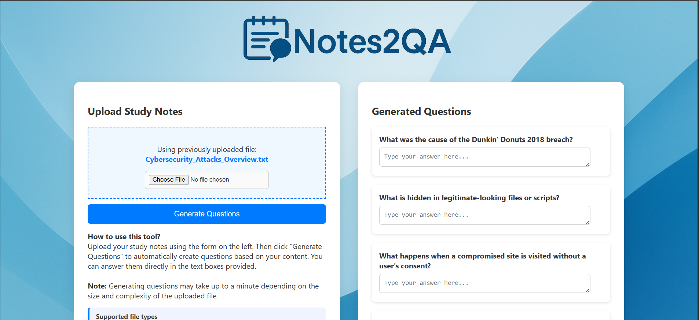

# 📝 Notes2QA

**Notes2QA** is an AI-powered web application that automatically generates study questions from uploaded notes. Users can upload files in `.txt`, `.pdf`, `.pptx`, or `.docx` format and receive intelligent questions to help reinforce their understanding of the material.

## 🚀 Features

- 📁 Upload study materials in multiple formats
- 🤖 Automatically generates questions using NLP models
- 🧠 Supports summarization and keyword-based chunking
- ✍️ Inline textboxes for practicing answers
- 💾 Caches explanations to speed up repeated uploads
- 📦 Option to download generated questions
- 🧹 Manual cache clearing for fresh processing
- 🌐 Clean, responsive UI


## 📸 Screenshot



## 🛠️ Tech Stack

- **Backend**: Python, Flask
- **NLP Models**: Hugging Face Transformers (T5, DistilBART, KeyBERT)
- **Frontend**: HTML, CSS
- **Libraries**:
  - `transformers`
  - `nltk`
  - `keybert`
  - `pdfminer.six`
  - `python-pptx`
  - `python-docx`

---

## 📂 File Upload Support

Supported file formats:
- `.txt`
- `.pdf`
- `.docx`
- `.pptx`

---

## 📦 Installation

1. **Clone the repository**
```bash
git clone https://github.com/yourusername/Notes2QA.git
cd Notes2QA
```

2. **Install dependencies**

```bash
pip install -r requirements.txt
Run the app
```


##🧠 Model Details
Summarization: sshleifer/distilbart-cnn-12-6

Question Generation: mrm8488/t5-base-finetuned-question-generation-ap

Keyword Extraction: KeyBERT

Models are cached locally on first use and stored in the models/ directory.

##🧹 Cache Management
You can clear stored summaries (explanations) using the Clear Cache button.

This is useful if files are updated or results seem stale.

##📝 License
MIT License
